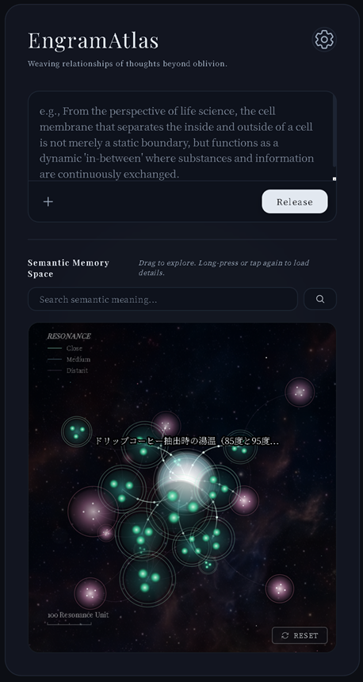
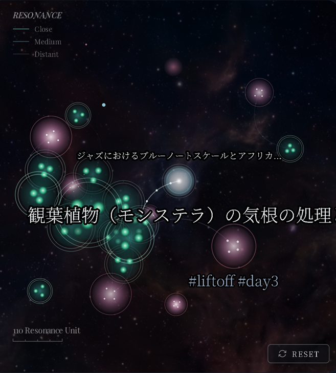
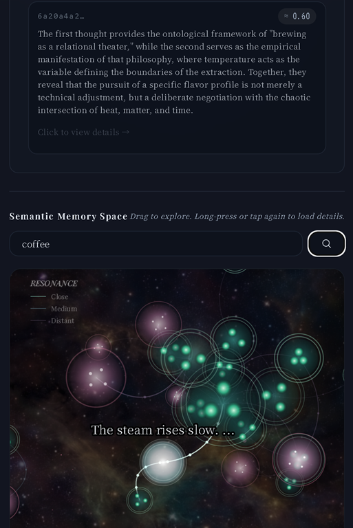

# EngramAtlas

[](https://opensource.org/licenses/Apache-2.0)
[](https://cloud.google.com)
[](https://www.mongodb.com/atlas)
[](https://nodejs.org)

## Overview

**EngramAtlas** is a bio-inspired knowledge engine. It receives raw human thoughts—fuzzy "cognitive noise" such as voice memos, handwritten sketches (images), PDFs, web URLs, and text snippets—and treats the input interface as a cell membrane. Rather than forcing these inputs into static, nested folders, the engine autonomously infers the relationships ("in-betweens") among them and dynamically links nodes in MongoDB Atlas to form a self-organizing, metabolic memory network.

Leveraging Gemini Flash for multimodal cognitive understanding and 3,072-dimensional vector embeddings, it maps every input into a shared semantic vector space, dynamically spinning bi-directional connections as context resonates.

---

## Architecture

```
[ User Input / Media / URL ]
            │
            ▼ POST /api/sendNoise
[ Node.js + Express (server.js Gateway) ]
            │
            ▼ (Google Cloud SDK / Sessions API / Local Process)
[ 🌟 Google Cloud Agent Builder (agent.py Brain) ]
     ├── 🧠 Gemini 3.5 High-level Inference & Planning
     └── 🛠️ Tools (OpenAPI / MCP Extensions)
                  │
                  ▼ (Autonomous Execution)
           [ MongoDB Atlas / Mock DB Fallback ]
         (engrams collection / Vector Search)
```

**Key Design Decisions:**

- **Google Cloud Agent Builder (ADK) Integration**: The core reasoning, intent classification (forget/metabolize), and multimodal orchestration are delegated to the Python-based Agent Builder model (`agent.py`) mimicking the Vertex AI Agent Engine ADK framework.
- **Node.js Express Gateway**: Renders the dynamic 3D Cell Membrane UI, manages user sessions (Firebase Auth), ensures SSRF network sanitization, and proxies client inputs directly to the Agent Builder sessions.
- **Dynamic Equilibrium & Resilient Fallback**: Monitors MongoDB connection status. If a query fails or network blocks the database (e.g. `querySrv ECONNREFUSED`), the gateway dynamically marks the database offline (`isMongoActive = false`) and seamlessly fallbacks to the in-memory mock store without crashing the application.
  

---

## Features

### 🎙️ Multimodal Ingestion (Autonomous Metabolism)

Ingests and unifies diverse formats—text, hand-drawn diagrams, web links, PDF documents, and microphone recordings:

- **Images & PDFs**: Gemini's multimodal vision decodes physical constraints, layouts, and contexts (e.g., capturing wood warping, grain irregularities, and DMR physics philosophy) and verbalizes them.
- **Web URLs**: Features a secure crawler with SSRF protection, redirect tracking, and automated authentication page bypass to generate clean summaries.
- **Audio Recordings**: Transcribes and processes spoken words natively via Gemini Audio.
  All inputs are translated into a standardized cognitive text block before projection into the 3,072-dimensional vector space.

### 🧬 Semantic Self-Organization

When a new "noise" node is added, the engine generates its vector via `gemini-embedding-2-preview` and measures cosine similarity against existing nodes in MongoDB (threshold: `0.55`). If they exceed the threshold, a bi-directional `related_links` connection is formed. Crucially, Gemini generates a `reason_of_connection` explaining _why_ these thoughts are conceptually linked.

### 📊 Interactive 3D Memory Map

Renders the entire knowledge graph on an HTML5 Canvas (`#memoryMapCanvas`) powered by a custom Force-Directed layout engine.



- **3D Camera Control**: Smooth mouse-driven Yaw/Pitch rotation, panning, and scroll-to-zoom.
- **Node Color-Coding (Semantic Density)**: Colors intuitively communicate how heavily a memory is connected:
  - ⚪ **Bright White**: The currently active focus node (nucleus).
  - 🔵 **Deep Blue**: Highly integrated nodes with **10 or more connections** (high density).
  - 🟢 **Teal-Green**: Connected nodes with **3 to 9 connections** (medium density).
  - 🔴 **Pink-Purple**: Isolated or newly added nodes with **2 or fewer connections** (low density).
- **Intuitive Interactions**: Drag nodes to reposition them; double-click a node to pull up the editing/refinement panel.
- **Semantic Pull Search**: Type a search query to vectorize it in real-time, visually pulling matching nodes closer and highlighting them.

### 🧹 Conversational Forget & Semantic Integrity

If the ingestion text contains delete/forget intent (e.g., "forget", "delete", "忘却"), the Agent Builder (`agent.py`) classifies the intent and triggers an autonomous forget flow. The gateway identifies the semantically closest target node, deletes it, and performs a `$pull` operation to surgically strip invalid links from all other nodes, maintaining perfect referential integrity.


### 🛡️ Triage-based Self-Healing & Fallback (Resilience)

Monitors API rate limits (HTTP 429) and network blips, categorizing errors into `TRANSIENT` or `FATAL`. If the error is transient, it retries up to 3 times using an **exponential backoff** algorithm (starting at 500ms).
Furthermore, if the database operations fail due to connection issues (e.g., MongoDB server timeout), the system automatically updates the connectivity status (`isMongoActive = false`) and fallbacks to the Mock DB system instantly, logging the recovery traces to guarantee consistency and stability.

---

## Document Schema

The `engrams` collection is designed with a flexible, self-organizing JSON schema:

```json
{
  "_id": "ObjectId",
  "content": "The merged and translated text representation of the input",
  "raw_input_type": "text | image | pdf | audio | url | mixed",
  "created_at": "ISODate",
  "metadata": {
    "scope": "PERSONAL",
    "tags": ["architecture", "wood-physics", "DMR"],
    "entropy_score": 0.5,
    "attachment": { "name": "sketch.png", "mimeType": "image/png" },
    "linkUrl": "https://..."
  },
  "vector_embeddings": [0.012, -0.045, "...(3072 values)"],
  "related_links": [
    {
      "to_engram_id": "ObjectId",
      "strength": 0.82,
      "reason_of_connection": "AI-generated explanation of context"
    }
  ],
  "evolution_history": [
    {
      "timestamp": "ISODate",
      "action": "create | self_organize_link | self_heal_success | refine",
      "comment": "..."
    }
  ]
}
```

---

## API Endpoints

| Method   | Endpoint             | Description                                                               |
| -------- | -------------------- | ------------------------------------------------------------------------- |
| `GET`    | `/`                  | Serves the responsive web UI                                              |
| `POST`   | `/api/sendNoise`     | Ingest a new thought, trigger self-organization / forget                  |
| `POST`   | `/api/updateEngram`  | Refine/update an existing engram, recalculating edges                     |
| `POST`   | `/api/forgetEngram`  | Manually delete an engram and cleanup other nodes' links                  |
| `GET`    | `/api/getAllEngrams` | Retrieve all engrams (optimized with vector removal for map performance)  |
| `GET`    | `/api/getEngram`     | Retrieve single engram with resolved related titles (N+1 query optimized) |
| `GET`    | `/api/search`        | Perform Gemini-powered semantic vector search across engrams              |
| `DELETE` | `/api/resetDatabase` | Clear all engrams from MongoDB or mock memory                             |

---

## Troubleshooting & Vector Migration

If you previously ran the application without a `GEMINI_API_KEY` (in Mock mode), the vectors stored in MongoDB Atlas are mock vectors (pseudo-random coordinates based on character codes).

When you later start the app with a valid `GEMINI_API_KEY`, search queries will generate real Gemini embeddings (`gemini-embedding-2-preview`). The mismatch in vector space will prevent semantic search from returning mock-vector nodes.

To diagnose and fix this mismatch, run the utilities provided in the `scratch` directory:

- **`scratch/check_db.js`**: Checks document counts, vector dimensions, and overall DB health.
- **`scratch/verify_mock_db.js`**: Automatically detects whether stored vectors are mock representations.
- **`scratch/migrate_embeddings.js`**: Re-generates and updates all mock vectors in the database to authentic Gemini embeddings using your current API key.

**Run Migration:**

```bash
node scratch/migrate_embeddings.js
```

---

## Quick Start

### 1. Configure environment variables

Copy `.env.example` to `.env` and fill in your keys:

```env
PORT=3000
GEMINI_API_KEY=your_gemini_api_key_here
MONGODB_URI=your_mongodb_atlas_connection_string_here
GEMINI_MODEL=gemini-flash-latest
GEMINI_EMBEDDING_MODEL=gemini-embedding-2-preview
```

_Note: If `MONGODB_URI` is left blank, the app automatically switches to the in-memory mock store, letting you start immediately without a database setup._

### 2. Install and run

Requires Node.js v18+.

```bash
npm install
npm start
```

Open your browser and navigate to [http://localhost:3000](http://localhost:3000).

### 3. Run the evaluation suite (EDD)

This project strictly adheres to **Evaluation Driven Development (EDD)**. We test specifications, autonomous links, resilience triage, and integrity via 9 core assertions:

```bash
npm run eval
```

A score of `100/100` (GREEN) ensures the engine satisfies all self-organizing memory requirements.

---

## License

Apache License, Version 2.0. See [LICENSE](./LICENSE) for details.
